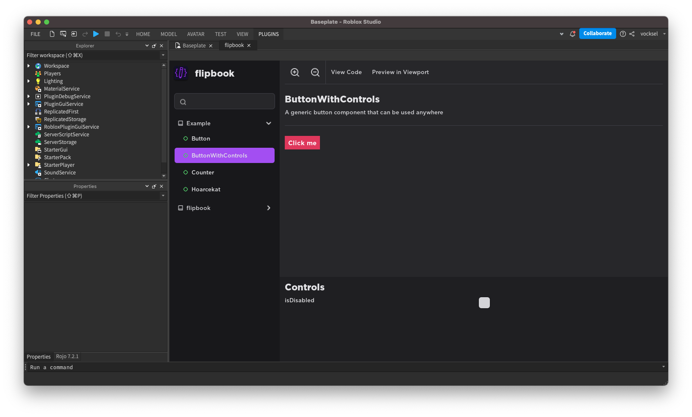

#  flipbook

flipbook is a storybook plugin that previews UI components in a sandboxed environment. With it you can isolate distinct parts of your game's UI to hammer out edge cases and complex states without having to run through the whole UI.

With native support for popular UI libraries like [Roact](https://github.com/roblox/roact), [Fusion](https://github.com/Elttob/Fusion), and [Roact 17](https://github.com/grilme99/CorePackages#roact17), no matter how you create UI you can write a story for it in flipbook

## Installation

You can install flipbook from the [Roblox marketplace](https://www.roblox.com/library/8517129161) or from the [GitHub releases](https://github.com/vocksel/flipbook/releases) page.

## Documentation

Learn how to use flipbook on the [documentation site](https://vocksel.github.io/flipbook).

## Contributing

Before opening a pull request, check out our [contributing guide](https://vocksel.github.io/flipbook/docs/contributing) to learn how we develop the plugin.

## License

[MIT License](LICENSE)
