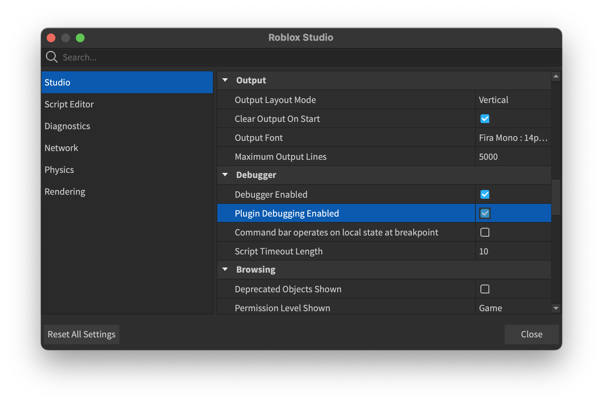

# Onboarding

Thank you for your interest in contributing to Flipbook! This guide will help you get your environment setup so you can have the best possible development experience.

:::info
All contents under the Contributing section are for the development of the Flipbook plugin. Please see [Getting Started](/docs/intro) for documentation on how to use Flipbook.
:::

## First-time setup

We use [Visual Studio Code](https://code.visualstudio.com/) to work on this project, so you'll get the best mileage from using it too. We also have several [recommended extensions](https://github.com/flipbook-labs/flipbook/blob/main/.vscode/extensions.json) that should be installed.

You will also need [Rokit](https://github.com/rojo-rbx/rokit/) for installing the various command-line tools we use.

With the above requirements satisfied, run the following commands from your clone of the repo to start developing:

```sh
# Install command-line tools (like Lune)
rokit install

# Install packages
lune run install
```

:::tip
When using VSCode, you can press `Ctrl+Shift+B` on Windows or `Cmd+Shift+B` on MacOS to execute the included build task which will build the Flipbook plugin for your OS.
:::

## Building

Part of our build process uses [darklua](https://github.com/seaofvoices/darklua) to compile our Luau source code for Roblox. This is largely to support string requires so our source code can use the same syntax as our Lune scripts.

### Build for Studio

The following command will build production Flipbook to your Roblox Studio plugins directory:

```sh
lune run build
```

Once built, open up a Baseplate to start interacting with the plugin.

Production builds prune development files like unit test and Flipbook's own Storybook and Stories. To keep development files, pass the `--target` flag to set the environment to build for:

```sh
lune run build --target dev
```

### Build to rbxm

When building, pass the `--output` flag to determine where Flipbook will build to.

Run the following to build Flipbook to the root of the repo:

```sh
lune run build --output Flipbook.rbxm
```

By default Flipbook builds to these directories:
* MacOS: `~/Documents/Roblox/Plugins`
* Windows: `%LOCALAPPDATA%/Roblox/Plugins`

## Testing

Run the following to run all unit tests for the project:

```sh
lune run test
```

We use jsdotlua's [Jest](https://github.com/jsdotlua/jest-lua) fork for authoring and executing unit tests. [Read the docs](https://jsdotlua.github.io/jest-lua/) and look to our existing `.spec.luau` modules for how to write tests.

:::tip
If your code is not properly tested, maintainers will let you know and offer suggestions on how to improve your tests so you can get your pull request merged.
:::

## Using Flipbook to develop Flipbook

Flipbook is made up of React components, each of which has a story file. This means you can use Flipbook itself for developing it.

Once you have Flipbook built, navigate to the Studio settings and turn on "Plugin Debugging Enabled."



Then load a new Baseplate and open the Flipbook plugin. Its storybook should now appear in the sidebar.


