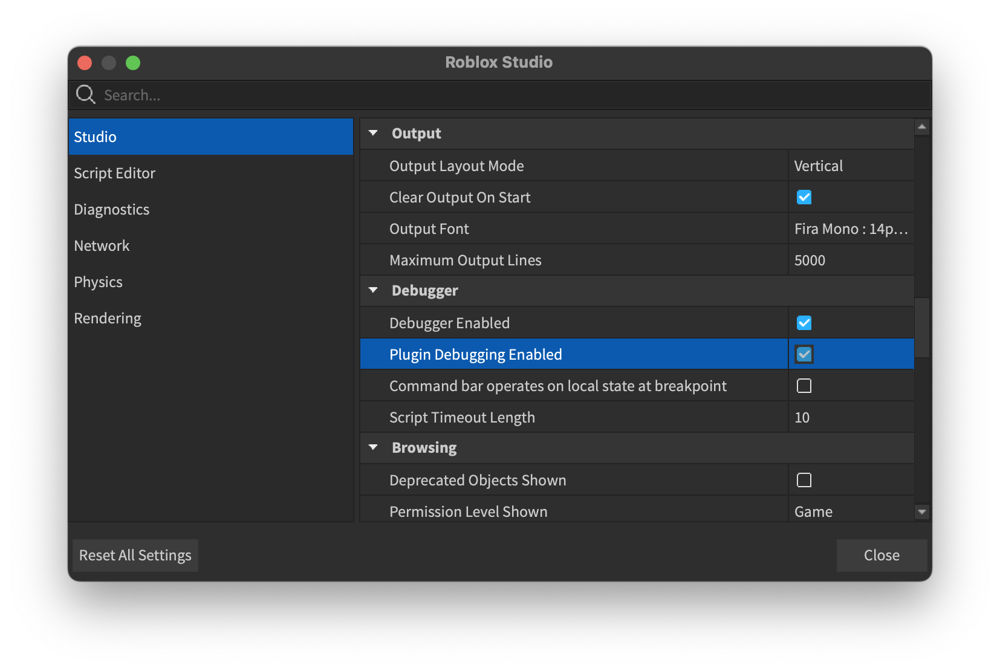

# Onboarding

Thank you for your interest in contributing to Flipbook! You can build and validate a contribution without access to any Flipbook Labs secrets.

:::info
This guide covers development of the Flipbook plugin. See [Getting Started](/docs/intro) to learn how to use Flipbook in your own project.
:::

## Fork and clone the repository

Start by [forking Flipbook](https://github.com/flipbook-labs/flipbook/fork). Clone your fork, then add the main repository as an `upstream` remote:

```sh
git clone https://github.com/<your-account>/flipbook.git
cd flipbook
git remote add upstream https://github.com/flipbook-labs/flipbook.git
```

Create each contribution from the latest `main` branch:

```sh
git fetch upstream
git switch -c my-change upstream/main
```

## Set up your environment

We use [Visual Studio Code](https://code.visualstudio.com/) to work on Flipbook. The repository includes [recommended extensions](https://github.com/flipbook-labs/flipbook/blob/main/.vscode/extensions.json).

Install [Rokit](https://github.com/rojo-rbx/rokit/), then run these commands from the repository root:

```sh
rokit install
lute run install
cp .env.template .env
```

The checked-in `.env.template` values are enough for builds, linting, and static analysis. Keep `.env` local and never commit credentials.

:::tip
In Visual Studio Code, press `Ctrl+Shift+B` on Windows or `Cmd+Shift+B` on macOS to run the included plugin build task.
:::

## Validate your change

Run the contributor check before opening or updating a pull request:

```sh
lute run check
```

This command sets up local type definitions, checks formatting and static analysis, and produces a development plugin build. It does not require an Open Cloud API key.

Every pull request needs one change entry. Add a Markdown file under [`.changes/`](https://github.com/flipbook-labs/flipbook/blob/main/.changes/README.md) that describes the user-visible effect. Internal-only maintenance uses a patch entry.

## Open a pull request

Push your branch to your fork, then open a pull request against `flipbook-labs/flipbook:main`.

GitHub runs standard fork builds with a read-only token and no repository secrets. Cloud tests and storybook preview publishing use protected jobs that may wait for a maintainer to review the contribution and approve them.

You do not need to request a Flipbook Labs Open Cloud key. If GitHub shows a first-time contributor approval banner or a protected job is waiting, no action is required from you.

## Building

Flipbook uses [darklua](https://github.com/seaofvoices/darklua) to compile Luau source code for Roblox and support string requires in both source code and Lute scripts.

### Build for Studio

The following command builds production Flipbook to your Roblox Studio plugins directory:

```sh
lute run build
```

Open a Baseplate in Studio to start interacting with the plugin.

Production builds prune development files such as unit tests, storybooks, and stories. Use the development channel to keep them:

```sh
lute run build --channel dev
```

Add `--watch` to rebuild automatically when files change.

### Build an rbxm file

Pass `--output` to choose where Flipbook writes the model. For example, this command writes it to the repository root:

```sh
lute run build --output Flipbook.rbxm
```

## Run cloud tests locally

Local cloud tests are optional. They require an Open Cloud API key and test universe that you control, with the corresponding values configured in your local `.env` file:

```sh
lute run test
```

Flipbook uses jsdotlua's [Jest](https://github.com/jsdotlua/jest-lua) fork for unit tests. Existing `.spec.luau` modules show the expected patterns.

## Use Flipbook to develop Flipbook

Flipbook's React components have story files, so you can develop the plugin through its own storybook.

After building Flipbook, open Studio settings and turn on "Plugin Debugging Enabled."



Load a new Baseplate and open Flipbook. Its storybook appears in the sidebar.
