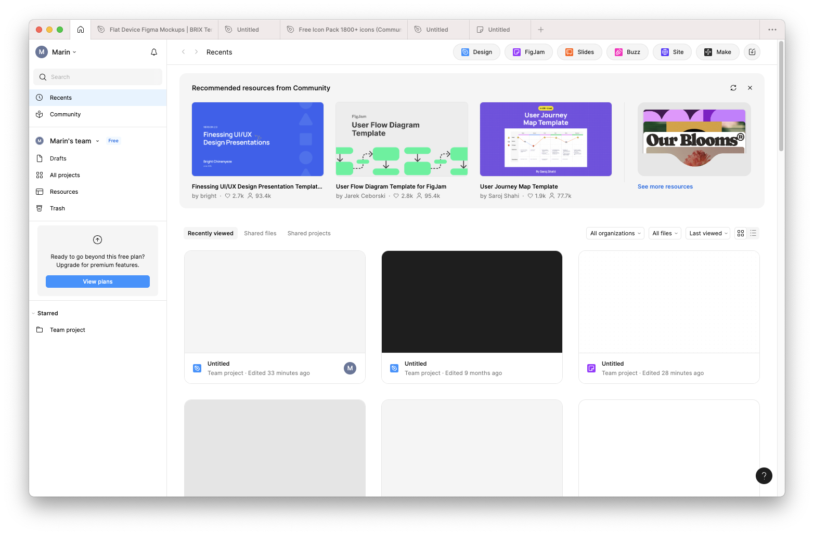
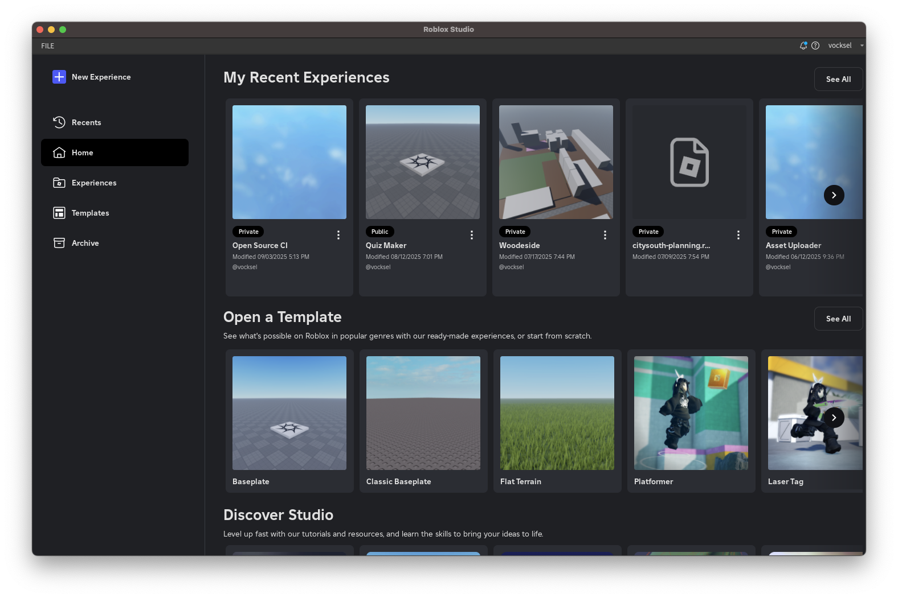

# Storybook Selection UX

Instead of displaying every storybook in the sidebar, we could do something like Figma or Roblox Studio by showing tiles for each storybook.

This would allow us to have a “recent” swimlane to help users quickly get back to the storybooks they're looking for.

We could include the following swimlanes:

- Recent storybooks (maybe also recent stories?)
- All storybooks
- Unavailable storybooks

Cons:

- What would a storybook tile look like? Just text? Since there's nothing to preview it might be better to just keep the explorer
