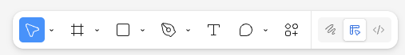

# Toolbar

General idea:

- Floating toolbar like Figma's
- Select the primary tool (Move, Select)
  - Select (default): allows the user to hover over the rendered elements. A border appears around the bounding box, and activating it will open the UI element in the explorer
  - Hand: Click and drag to move around the story view
- Drag to reposition the toolbar (probably just snaps to top/bottom. Maybe reorient for left/right?)

Figma also has zoom out/in buttons and a help button mounted to the bottom right corner in FigJams

