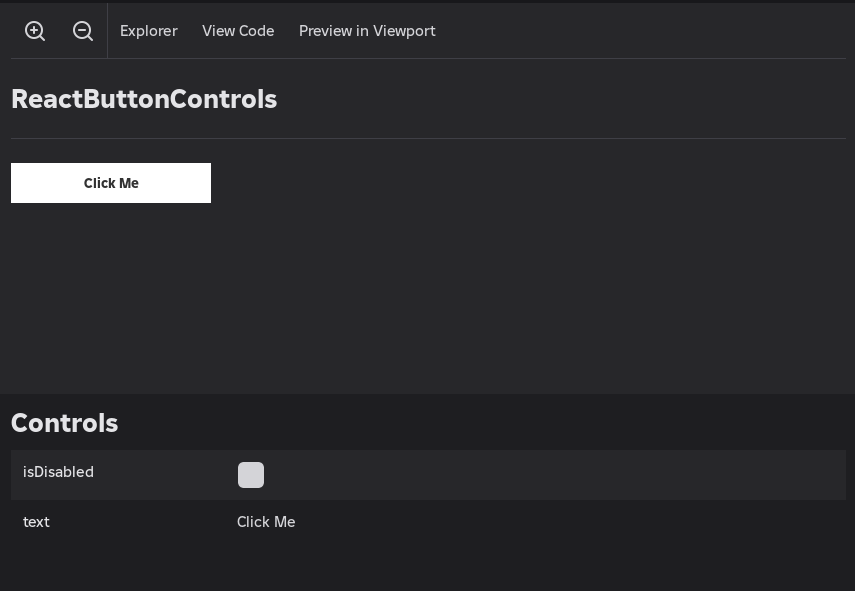
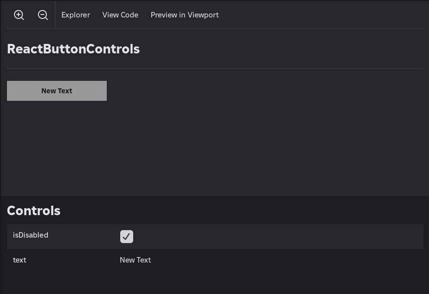

import Tabs from "@theme/Tabs";
import TabItem from "@theme/TabItem";
import CodeBlock from "@theme/CodeBlock";

import ReactButtonControls from "!!raw-loader!@site/../workspace/code-samples/src/React/ReactButtonControls.luau";
import ReactButtonControlsStory from "!!raw-loader!@site/../workspace/code-samples/src/ReactStoryteller/ReactButtonControls.story.luau";
import ReactButtonTypedControls from "!!raw-loader!@site/../workspace/code-samples/src/ReactStoryteller/ReactButtonTypedControls.luau";
import ReactButtonTypedControlsStory from "!!raw-loader!@site/../workspace/code-samples/src/ReactStoryteller/ReactButtonTypedControls.story.luau";
import BooleanVanilla from "!!raw-loader!@site/../workspace/code-samples/src/CreatingStoriesControls/BooleanVanilla.luau";
import BooleanFlipbookApi from "!!raw-loader!@site/../workspace/code-samples/src/CreatingStoriesControls/BooleanFlipbookApi.luau";
import StringVanilla from "!!raw-loader!@site/../workspace/code-samples/src/CreatingStoriesControls/StringVanilla.luau";
import StringFlipbookApi from "!!raw-loader!@site/../workspace/code-samples/src/CreatingStoriesControls/StringFlipbookApi.luau";
import NumberVanilla from "!!raw-loader!@site/../workspace/code-samples/src/CreatingStoriesControls/NumberVanilla.luau";
import NumberFlipbookApi from "!!raw-loader!@site/../workspace/code-samples/src/CreatingStoriesControls/NumberFlipbookApi.luau";
import ColorFlipbookApi from "!!raw-loader!@site/../workspace/code-samples/src/CreatingStoriesControls/ColorFlipbookApi.luau";
import DateFlipbookApi from "!!raw-loader!@site/../workspace/code-samples/src/CreatingStoriesControls/DateFlipbookApi.luau";
import SliderFlipbookApi from "!!raw-loader!@site/../workspace/code-samples/src/CreatingStoriesControls/SliderFlipbookApi.luau";
import SelectAndRadioFlipbookApi from "!!raw-loader!@site/../workspace/code-samples/src/CreatingStoriesControls/SelectAndRadioFlipbookApi.luau";
import MultiSelectAndCheckFlipbookApi from "!!raw-loader!@site/../workspace/code-samples/src/CreatingStoriesControls/MultiSelectAndCheckFlipbookApi.luau";
import Constructors from "!!raw-loader!@site/../workspace/code-samples/src/CreatingStoriesControls/Constructors.luau";

# Controls

Controls let you configure a story from Flipbook's Controls panel without editing code. As you adjust them, the story live-reloads with the new values — a fast way to test variants, edge cases, and different prop combinations.

## Quick Start

The simplest way to add controls is to provide raw values in the story's `controls` table. Flipbook infers the input widget from the value type: a `boolean` becomes a toggle, a `string` becomes a text field, and a `number` becomes a number input.

Here's an example component that accepts a label and a disabled state as props:

<CodeBlock language="lua" title="ReactButtonControls.luau">
	{ReactButtonControls}
</CodeBlock>

The story passes those props through `props.controls`:

<CodeBlock language="lua" title="ReactButtonControls.story.luau">
	{ReactButtonControlsStory}
</CodeBlock>

Opening this story in Flipbook reveals a Controls panel where both values can be edited live.



Changing a control immediately re-renders the story with the updated values.



## Flipbook API

For richer input widgets and additional configuration, use the typed constructor functions from the Flipbook API. These unlock things like color pickers, sliders, and dropdown lists, and let you set defaults, ranges, and custom display options.

Here's the same button extended with typed controls for its text content, font size, text color, size, and disabled state:

<CodeBlock language="lua" title="ReactButtonTypedControls.luau">
	{ReactButtonTypedControls}
</CodeBlock>

<CodeBlock language="lua" title="ReactButtonTypedControls.story.luau">
	{ReactButtonTypedControlsStory}
</CodeBlock>

:::tip
Type the `controls` table as `Storyteller.StoryControlsSchema` to get autocomplete and type-checking. See [Typechecking](/docs/creating-stories/typechecking) for more.
:::

## Control Types

### Boolean

Renders a toggle switch. Use it for any on/off prop.

<Tabs groupId="main">
	<TabItem value="default" label="Vanilla" default>
		<CodeBlock language="lua" title="BooleanVanilla.luau">
			{BooleanVanilla}
		</CodeBlock>
	</TabItem>
	<TabItem value="storyteller" label="Flipbook API">
		<CodeBlock language="lua" title="BooleanFlipbookApi.luau">
			{BooleanFlipbookApi}
		</CodeBlock>
	</TabItem>
</Tabs>

The control value is a `boolean`.

### String

Renders a text input field.

<Tabs groupId="main">
	<TabItem value="default" label="Vanilla" default>
		<CodeBlock language="lua" title="StringVanilla.luau">
			{StringVanilla}
		</CodeBlock>
	</TabItem>
	<TabItem value="storyteller" label="Flipbook API">
		<CodeBlock language="lua" title="StringFlipbookApi.luau">
			{StringFlipbookApi}
		</CodeBlock>
	</TabItem>
</Tabs>

The control value is a `string`.

### Number

Renders a numeric input field. Optionally constrain the value with a `range` or set an increment with `step`.

<Tabs groupId="main">
	<TabItem value="default" label="Vanilla" default>
		<CodeBlock language="lua" title="NumberVanilla.luau">
			{NumberVanilla}
		</CodeBlock>
	</TabItem>
	<TabItem value="storyteller" label="Flipbook API">
		<CodeBlock language="lua" title="NumberFlipbookApi.luau">
			{NumberFlipbookApi}
		</CodeBlock>
	</TabItem>
</Tabs>

The control value is a `number`.

### Color

Renders a color picker. The control value is a `Color3`.

<CodeBlock language="lua" title="ColorFlipbookApi.luau">
	{ColorFlipbookApi}
</CodeBlock>

### Date

Renders a date and time picker. The control value is a `DateTime`.

<CodeBlock language="lua" title="DateFlipbookApi.luau">
	{DateFlipbookApi}
</CodeBlock>

### Slider

Renders a range slider. Use it when a numeric prop should stay within fixed bounds.

<CodeBlock language="lua" title="SliderFlipbookApi.luau">
	{SliderFlipbookApi}
</CodeBlock>

The control value is a `number` clamped to the given range.

### Select and Radio

Single-pick controls that let the user choose one value from a list.

- **Select** renders a dropdown menu.
- **Radio** renders a row of radio buttons.

<CodeBlock language="lua" title="SelectAndRadioFlipbookApi.luau">
	{SelectAndRadioFlipbookApi}
</CodeBlock>

The `items` array accepts any [`StoryControlValue`](#storycontrolvalue). If no `default` is provided, the first item is selected. The control value is a single `StoryControlValue`.

### MultiSelect and Check

Multi-pick controls that let the user choose any number of values from a list.

- **MultiSelect** renders a dropdown with checkboxes.
- **Check** renders a row of checkboxes.

<CodeBlock language="lua" title="MultiSelectAndCheckFlipbookApi.luau">
	{MultiSelectAndCheckFlipbookApi}
</CodeBlock>

The `default` is a table of pre-selected items. If omitted, nothing is selected. The control value is a `{StoryControlValue}` table.

## API Reference

### Constructors

| **Function**               | **Signature**                                                                        |
| -------------------------- | ------------------------------------------------------------------------------------ |
| `createBooleanControl`     | `(default: boolean?) -> BooleanControl`                                              |
| `createStringControl`      | `(default: string?) -> StringControl`                                                |
| `createNumberControl`      | `(default: number?, range: NumberRange?, step: number?) -> NumberControl`            |
| `createColorControl`       | `(default: Color3?) -> ColorControl`                                                 |
| `createDateControl`        | `(default: DateTime?) -> DateControl`                                                |
| `createSliderControl`      | `(default: number?, range: NumberRange?, step: number?) -> SliderControl`            |
| `createSelectControl`      | `(items: { StoryControlValue }, options: SelectOptions?) -> SelectControl`           |
| `createRadioControl`       | `(items: { StoryControlValue }, options: RadioOptions?) -> RadioControl`             |
| `createMultiSelectControl` | `(items: { StoryControlValue }, options: MultiSelectOptions?) -> MultiSelectControl` |
| `createCheckControl`       | `(items: { StoryControlValue }, options: CheckOptions?) -> CheckControl`             |

All constructors are available through the Flipbook API:

<CodeBlock language="lua" title="Constructors.luau">
	{Constructors}
</CodeBlock>

### SelectOptions / RadioOptions

Passed as the second argument to `createSelectControl` and `createRadioControl`.

| **Property** | **Type**                                                     | **Description**                                                                                 |
| ------------ | ------------------------------------------------------------ | ----------------------------------------------------------------------------------------------- |
| `default`    | `StoryControlValue?`                                         | The initially selected item. Defaults to the first item if omitted. Must be present in `items`. |
| `tostring`   | `((value: StoryControlValue) -> string)?`                    | Custom display function for rendering item labels.                                              |
| `sort`       | `((a: StoryControlValue, b: StoryControlValue) -> boolean)?` | Custom sort function for ordering the items list.                                               |

### MultiSelectOptions / CheckOptions

Passed as the second argument to `createMultiSelectControl` and `createCheckControl`.

| **Property** | **Type**                                                     | **Description**                                                                                                  |
| ------------ | ------------------------------------------------------------ | ---------------------------------------------------------------------------------------------------------------- |
| `default`    | `{ StoryControlValue }?`                                     | The initially selected items. Defaults to an empty selection if omitted. All entries must be present in `items`. |
| `tostring`   | `((value: StoryControlValue) -> string)?`                    | Custom display function for rendering item labels.                                                               |
| `sort`       | `((a: StoryControlValue, b: StoryControlValue) -> boolean)?` | Custom sort function for ordering the items list.                                                                |

### StoryControlValue

The set of value types that can appear as control values or list items:

```
boolean | number | string | Color3 | DateTime | EnumItem
```
