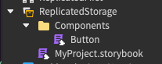
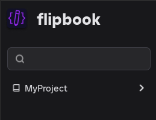

# Writing Stories

Before flipbook can discover your Stories, you need a Storybook. A Storybook is any ModuleScript with a `.storybook` extension. It acts as the topmost configuration for each collection of Stories in your project.

Relatedly, a Story is any ModuleScript with a `.story` extension, typically parented as a sibling to the UI component it renders.

Stories are what you will be working with the most. The Storybook is simply what tells flipbook how to find them and render them.

## Create a Storybook

A Storybook can be parented anywhere in the experience. The only requirement is that it defines a `storeRoots` array so flipbook knows where to search for Stories.

To start, create a Storybook in ReplicatedStorage named `MyProject.storybook`.

Here's how this looks in Studio:



such as ReplicatedStorage and set the `storyRoots` array to point to at least one Instance that contains your Stories.

And the contents of the Storybook is:

```lua
return {
    storyRoots = {
        script.Parent.Components
    },
}
```



:::info
For React and Roact projects it is common to have a "Components" folder where all UI components and their Stories are stored. We follow this convention in our docs.
:::

## Discovering stories

The `storyRoots` array is the only required property in a Storybook and can manage many "roots," where a root is simply an Instance that has Story modules nested inside it.

By default, flipbook uses a function-based renderer with support for Roblox Instances to get you up and running. The following is all you need to write your first Story:

```lua
return {
    story = function()
      local label = Instance.new("TextLabel")
      label.Text = "Hello, World!"

      return label
    end
}
```

flipbook also has built-in support for UI libraries like [React](/frameworks/react) and [Fusion](/frameworks/fusion). You can tell flipbook to use a particular UI library by supplying the `packages` object.

```lua
local ReplicatedStorage = game:GetService("ReplicatedStorage")

local React = require(ReplicatedStorage.Packages.React)
local ReactRoblox = require(ReplicatedStorage.Packages.ReactRoblox)

return {
    story = function()
		return React.createElement("TextLabel", {
			label.Text = "Hello, World!"
		})
	end,
    packages = {
        React = React,
        ReactRoblox = ReactRoblox
    }
}
```

It can be tedious to supply the `packages` object in each Story module, which is why it’s more common to add them globally in the Storybook module so that all Stories can render with the UI library you use across your project.

```lua
local ReplicatedStorage = game:GetService("ReplicatedStorage")

local React = require(ReplicatedStorage.Packages.React)

return {
    story = function()
		return React.createElement("TextLabel", {
			label.Text = "Hello, World!"
		})
	end,
}
```

```lua
local ReplicatedStorage = game:GetService("ReplicatedStorage")

local React = require(ReplicatedStorage.Packages.React)
local ReactRoblox = require(ReplicatedStorage.Packages.ReactRoblox)

return {
    storyRoots = {
		script.Parent.Components
	},
    packages = {
        React = React,
        ReactRoblox = ReactRoblox
    }
}
```

## Manual story

Return value is a function. `target` is not implicitly cleaned in this case
```lua
return {
    story = function(target, props)
        local gui = Instance.new("TextLabel")
        gui.Parent = target

        return function()
            gui:Destroy()
        end
    end
}
```

Return value is an Instance. Renderer will implicitly Parent the Instance to the container and call Destroy when unmounting

```lua
return {
    story = function(props)
        local gui = Instance.new("TextLabel")

        return gui
    end
}
```

No return value. Renderer will implicitly call `ClearAllChildren` on the container, but no other efforts will be made to cleanup side-effects of the story

```lua
return {
    story = function(props)
        local gui = Instance.new("TextLabel")
    end
}
```

## UI Labs and Hoarcekat

```lua
return function(target: Instance, props: { [string]: any })
    local gui = Instance.new("TextLabel")
    gui.Parent = target

    return function()
        gui:Destroy()
    end
end
```

## Controls

TODO TODO TODO

## Type Checking

See [Story and Storybook typechecking](https://www.notion.so/Story-and-Storybook-typechecking-12f95b7912f8809b9842f96897b55438?pvs=21)

## SurfaceGui and BillboardGui

https://github.com/flipbook-labs/flipbook/issues/230
