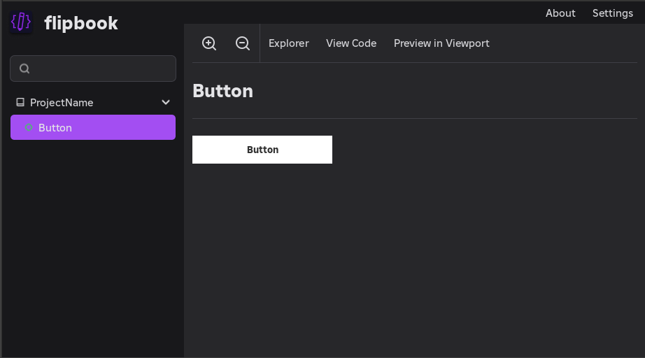
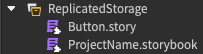

import CodeBlock from "@theme/CodeBlock";

import DefaultStorybook from "!!raw-loader!@site/../code-samples/src/Default/ProjectName.storybook.luau";
import DefaultStory from "!!raw-loader!@site/../code-samples/src/Default/Button.story.luau";
import ReactStorybook from "!!raw-loader!@site/../code-samples/src/React/React.storybook.luau";
import ReactButton from "!!raw-loader!@site/../code-samples/src/React/ReactButton.luau";
import ReactButtonStory from "!!raw-loader!@site/../code-samples/src/React/ReactButton.story.luau";
import ReactButtonExplicitPackagesStory from "!!raw-loader!@site/../code-samples/src/React/ReactButtonExplicitPackages.story.luau";

# Writing Stories

Before flipbook can discover your Stories, you need a Storybook. A Storybook is any ModuleScript with a `.storybook` extension. It acts as the topmost configuration for each collection of Stories in your project.

Relatedly, a Story is any ModuleScript with a `.story` extension, typically parented as a sibling to the UI component it renders.

Stories are what you will be working with the most. The Storybook is simply what tells flipbook how to find them and render them.

## Getting started

A Storybook can be parented anywhere in the experience. The only requirement is that it defines a `storyRoots` array so flipbook knows where to search for Stories.

The simplest Storybook looks like this:

<CodeBlock language="lua" title="ProjectName.storybook.luau">
	{DefaultStorybook}
</CodeBlock>

And here's an example of a Story that renders a TextButton:

<CodeBlock language="lua" title="Button.story.luau">
	{DefaultStory}
</CodeBlock>

In the flipbook plugin, opening the Button story will render out the component.

From there, making changing to the Story will live-reload the rendered button.

To connect it back to Studio, these files could simply be stored in ReplicatedStorage as ModuleScripts like so:

## Using frameworks

By default, flipbook uses a function-based renderer with support for Roblox Instances to get you up and running. Simply returning an Instance allows flipbook to manage the creation and destruction of that Instance so you don't leak memory while working.

flipbook also has built-in support for UI libraries like [React](/docs/frameworks/react) and [Fusion](/docs/frameworks/fusion). The full list can be seen on the [Frameworks](/docs/frameworks/) page.

You can tell flipbook to use a particular UI library by passing in the `packages` object. Here's an example with React:

<CodeBlock language="lua" title="ReactButton.story.luau">
	{ReactButtonExplicitPackagesStory}
</CodeBlock>

It can be tedious to supply the `packages` object in each Story module, which is why it is more common to add them globally in the Storybook so that all Stories can render with the UI library you use across your project.

The following example splits out the body of the story to a ReactButton component and offloads the definition of `packages` to the Storybook:

<CodeBlock language="lua" title="ReactButton.luau">
	{ReactButton}
</CodeBlock>

<CodeBlock language="lua" title="ReactButton.story.luau">
	{ReactButtonStory}
</CodeBlock>

<CodeBlock language="lua" title="ReactProject.storybook.luau">
	{ReactStorybook}
</CodeBlock>

:::tip
Stories can individually override the global `packages` so if you need to use another UI library for a particular Story, you can do that.
:::
