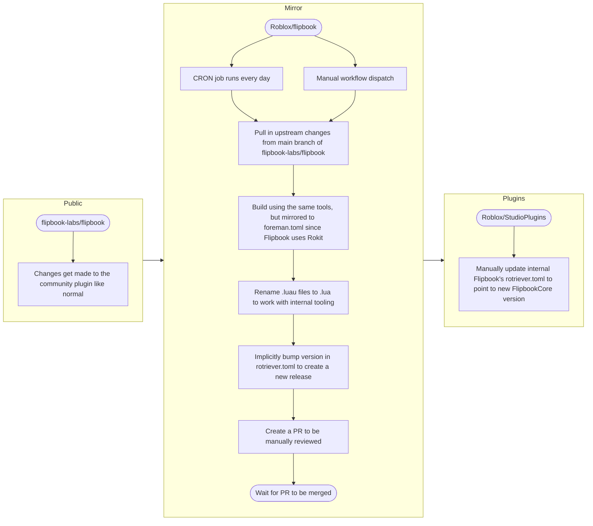
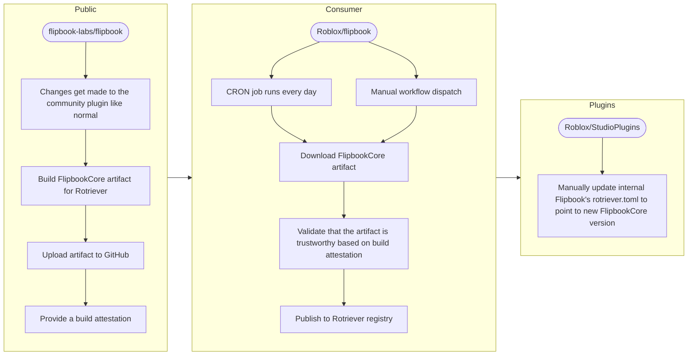

# Flipbook → Roblox Internal Deployments

> [!note] 📌
> **MOVED: **[**https://roblox.atlassian.net/wiki/spaces/foundation/pages/4279697827/FlipbookCore+deployment+strategy+planning**](https://roblox.atlassian.net/wiki/spaces/foundation/pages/4279697827/FlipbookCore+deployment+strategy+planning)

## Problem

I’m not happy with the way changes get merged into the Roblox mirror. Flipbook should really just create a build artifact in the upstream repo that can be validated on the Roblox side and then deployed to Rotriever/Artifactory.

## Current Deployment Flow

Update loop:

1. CRON job runs daily on `Roblox/flipbook`
2. Pull in upstream changes to `flipbook-labs/flipbook`
3. Use the same tools to build FlipbookCore
    1. This step bundles up all of Flipbook’s package dependencies from Wally along with its source code to produce the final build artifact
    2. Flipbook uses [Rokit](https://github.com/rojo-rbx/rokit/), so we [mirror each of the tools in Rokit to a foreman.toml](https://github.com/Roblox/flipbook/blob/roblox/foreman.toml). This is super brittle and has caused failures in the workflow a few times already
4. Flatten the directory structure so only FlipbookCore remains, stripping out all other source code
5. Implicitly bump the version in `rotriever.toml` so we always have something unique to publish, even when Flipbook hasn’t released anything on prod
6. Create a PR with the changes to be manually reviewed and merged

How deployments work now:

7. **Update loop** PR manually merged
8. Automatically deploy to Rotriever registry
9. Manually update `rotriever.toml` in StudioPlugins to point to the new FlipbookCore version

## Proposed Deployment Flow

* We’re going to have the three groups but the goal is to simplify how much has to be done on the mirror. Ideally it just needs to verify the artifact from upstream and send it on its way to Artirfactory
* Look up later: is there a nice way to make the blocks different colors so I can show the new additions I’m proposing to `public` for instance? i.e. “Changes get made […]” → “Builds a new Rotriever target” →  “attests FlipbookCore package for verification on mirror” where everything after the first arrow could be green

We will always need _some_ layer in between to consume, vet, and deploy the public artifact. Which doesn’t necessarily have to be a mirror. Maybe this could be a LaaS project? Or a BEDEV2 service, but that feels heavy

## References

10. Artifact attestation
    1. [Using artifact attestations to establish provenance for builds - GitHub Docs](https://docs.github.com/en/actions/how-tos/secure-your-work/use-artifact-attestations/use-artifact-attestations)
    2. [Artifact attestations - GitHub Docs](https://docs.github.com/en/actions/concepts/security/artifact-attestations)
    3. [Best practices for securing your build system - GitHub Docs](https://docs.github.com/en/code-security/supply-chain-security/end-to-end-supply-chain/securing-builds)
    4. [https://www.ianlewis.org/en/understanding-github-artifact-attestations](https://www.ianlewis.org/en/understanding-github-artifact-attestations)
11. [https://roblox.atlassian.net/wiki/spaces/foundation/pages/3878912708/Flipbook+for+Builders#Consuming-Flipbook-through-Rotriever](https://roblox.atlassian.net/wiki/spaces/foundation/pages/3878912708/Flipbook+for+Builders#Consuming-Flipbook-through-Rotriever)
12. [[tech/publishing-to-rotriever|Publishing to Rotriever]]
13. [https://github.com/actions/attest-build-provenance](https://github.com/actions/attest-build-provenance)

---

## Todo

- [x] Create a diagram of the current flow so I can get feedback (from EE? Security?) on best practices for consuming Flipbook

## Questions to Ask Security/EE

14. As the author of an upstream repo that we mirror, are there ways to make it safe enough that the upstream repo can handle all of the artifact building in such a way that we can verify as a consumer that it is safe?
15. Is there a future where we wouldn’t need a mirror repo in between?
    1. We’ll always need _some_ layer in between to consume, vet, and deploy the public artifact. Which doesn’t necessarily have to be a mirror. Maybe this could be a LaaS project? Or a BEDEV2 service but that feels heavy
