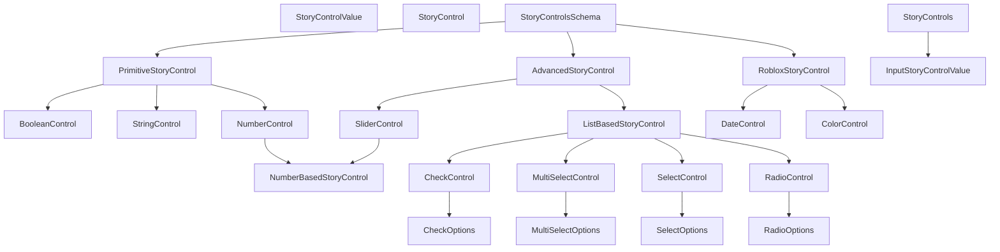

# Story Controls

## Overview

Controls are Flipbook's mechanism for defining parameters to pass off to the story to live-edit it. Controls can be used to dynamically change props, styles, and other component properties, allowing components to be live-edited.

![[assets/Screenshot_2025-12-28_at_9.50.56_AM.png]]

## Problems

Flipbook's controls are super limited, only supporting primitive data types with fairly basic UI for modifying them. This is one of the areas of the plugin that leaves a lot to be desired, and alternatives like UI Labs blow us out of the water with their controls

1. The datatypes for controls are too limited. Flipbook only supports strings, booleans, numbers, and arrays of those datatypes. Some light support for Enums also exists
2. Writing a story's controls schema should be more expressive, allowing for more control types to be defined, along with providing extra information like descriptions, default values, and explicit control types.
3. Bridging controls between Flipbook and Storyteller isn't going well. Flipbook needs to 1) read a story to know what controls it accepts so it can render them out and 2) keep track of the current modified state of each control value.

## Requirements

1. New control schema
    1. Introduce a more expressive control schema akin to [Storybook’s ArgTypes](https://storybook.js.org/docs/api/arg-types)
2. Full UI Labs compatibility
   3. Scoped to just controls for now but the goal is 1:1 interop with UI Labs so stories Just Work
   4. Migration logic will detect if the control schema is using UI Labs' schema and migrate it to one Flipbook supports.
3. Introduce more supported data types for controls
   6. Roblox datatypes like Color3 and DateTime
4. Allow users to define more complex controls
   8. Filters for String controls
   9. Improvements to Number controls, like specifying constraints
   10. Mix together simple and complex controls, like using `foo = "Hello, World!` to represent a String control
5. 1:1 interop with prior controls schema
   12. Users can decide to use the new schema with the provided constructors, or continue with simple controls

Stretch goals:

1. Create a proper Table component for rendering out controls. This way the Name column can be auto-sized to fill based on the widest cell
2. Support more Roblox data types like UDim2, Vector3 and Instances
3. Create a new Flipbook utility package that's essentially just a rebrand of Storyteller
   4. This way users will write `local Flipbook = …` in their stories, which cements the link between the story and the plugin
   5. Export most of the same things as Storyteller, like the control constructors and types

## Implementation

The source for controls lives in two distinct places:
1. Storyteller,
2. Flipbook, by using Storyteller's Controls API to build out the frontend UI

Flow:
* **Current**: Screen → StoryCanvas → StoryView → StoryPreview
* **Proposed**: Screen → StoryView → StoryPreview → Storyteller.StoryContainer

Where StoryView handles the full story page, keeps track of control changes, and contains StoryPreview, which handles story render errors and whether to mount the story in the plugin widget or in the 3D viewport.

## Supported Data Types

## Solution

1. New control schema
   2. Introduce a more expressive control schema akin to [Storybook’s ArgTypes](https://storybook.js.org/docs/api/arg-types)
2. New data types
3. UI Labs compatibility 2. Migration logic will detect if the control schema is using UI Labs' schema and migrate it to one Flipbook supports.

# Stretch Goals

1. Create a proper Table component for rendering out controls. This way the Name column can be auto-sized to fill based on the widest cell
2. Support more Roblox data types like UDim2 and Vector3

# Implementation

The source for controls lives in two distinct places:

1. Storyteller,
2. Flipbook, by using Storyteller's Controls API to build out the frontend UI

| **Current**  | Screen → StoryCanvas → StoryView → StoryPreview                |
| ------------ | -------------------------------------------------------------- |
| **Proposed** | Screen → StoryView → StoryPreview → Storyteller.StoryContainer |

Where StoryView handles the full story page, keeps track of control changes, and contains StoryPreview, which handles story render errors and whether to mount the story in the plugin widget or in the 3D viewport.

## Supported Data Types

The following table keeps track of all the data types we support now and intend to support in the future.

Also includes a UI Labs comparison. We should ultimately be comparing against ourselves, but it's good to keep tabs on the competition.

![[control-data-types.base|Control Data Types.base]]

## Schema

1. `StoryControlsSchema`: Describes what controls the story can accept
2. `StoryControl`: Default values for the ControlSchema
3. `StoryControls`: Controls specified by the user that get hydrated by `StoryControlsSchema`

```lua
export type StoryControl =
	StringControl
	| BooleanControl
	| NumberControl
	| SliderControl
	| SelectControl<unknown>
	| MultiSelectControl<unknown>
	| CheckControl<unknown>
	| RadioControl<unknown>
	| ColorControl
	| DateControl

export type StoryControlsSchema = {
	[string]: StoryControl,
}

export type StoryControls = {
	[string]: unknown,
}
```

## Components

UI elements needed to support data types:

1. Select one
    1. `Foundation.RadioGroup`
2. Multi-select
    1. I'd like to make something akin to the following. I don't think Foundation has something like that built in, but could be made by composing Checkbox with a label
        
3. Date picker: `Foundation.DateTimePicker`
4. Color picker: `Foundation.ColorPicker`
5. CSV input to Roblox data type: `Foundation.TextInput`
6. Range slider: `Foundation.Slider`
7. Instance picker: Out of scope
8. Sequence widget: Out of scope

## UI Labs Compatibility

[https://github.com/PepeElToro41/ui-labs-utils](https://github.com/PepeElToro41/ui-labs-utils)

If we wind up needing a library like UILabs to support controls, maybe Flipbook could install and manage a copy of Storyteller in the experience? For Studio users. And let folks know to use Wally if they're Rojo users?

> [!note]+ UI Labs controls type definitions
>
> ```lua
> UILabs.Boolean(def: boolean): {
> 	ControlValue: boolean,
> 	EntryType: "Control",
> 	Type: "Boolean",
> }
> ```
>
> ```lua
> UILabs.Choose<T>(list: { T }, def: number?): {
> 	ConrolValue: T,
> 	DefIndex: number,
> 	EntryType: "Control",
> 	List: { T },
> 	Type: "Choose",
> }
> ```
>
> ```lua
> UILabs.Datatype.Color3(def: Color3): {
> 	ControlValue: Color3,
> 	EntryType: "Control",
> 	Type: "Color3",
> }
> ```
>
> ```lua
> UILabs.EnumList<T>(list: { [string]: T }, def: string): {
> 	ControlValue: T,
> 	DefIndex: string,
> 	EntryType: "Control",
> 	List: { [string]: T },
> 	Type: "EnumList"
> }
> ```
>
> ```lua
> UILabs.Number(
> 	def: number,
> 	min: number?,
> 	max: number?,
> 	step: number?,
> 	dragger: boolean?,
> 	sensitivity: number?
> ): {
> 	ControlValue: number,
> 	Dragger: boolean,
> 	EntryType: "Control",
> 	Max: number?,
> 	Min: number?,
> 	Sensibility: number,
> 	Step: number?,
> 	Type: "Number",
> }
> ```
>
> ```lua
> UILabs.Object(
> 	className: string?,
> 	def: Instance?,
> 	predicator: ((instance: Instance) -> boolean)?
> ): {
> 	ClassName: string,
> 	ControlValue: Instance?,
> 	EntryType: "Control",
> 	Predicator: ((instance: Instance) -> boolean)?,
> 	Type: "Object",
> }
> ```
>
> ```lua
> UILabs.RGBA(def: Color3, transparency: number?): {
> 	ControlValue: {
> 		Color: Color3,
> 		Transparency: number -- Defaults to 0
> 	},
> 	EntryType: "Control",
> 	Type: "RGBA"
> }
> ```
>
> ```lua
> UILabs.Slider(def: number, min: number, max: number, step: number?): {
> 	ControlValue: number,
> 	EntryType: "Control",
> 	Max: number,
> 	Min: number,
> 	Step: number?,
> 	Type: "Slider",
> }
> ```
>
> ```lua
> UILabs.String(def: string, filters: { (input: string, oldInput: string) -> string }?): {
> 	ControlValue: string,
> 	EntryType: "Control",
> 	Filters: { (input: string, oldInput: string) -> string }?,
> 	Type: "String",
> }
> ```

Comprehensive example of using controls in UI Labs ([source](https://ui-labs.luau.page/docs/controls/advanced#enum-list-control)):

```lua
local UILabs = require(...) -- Path of your Utility Package

local controls = {
   -- [[ Choose ]] --
   Theme = UILabs.Choose({"Dark", "Light"}),
   Currency = UILabs.Choose({"Coins", "Gems"}),

   -- [[ EnumList ]] --
   WindowSize = UILabs.EnumList({
      Mobile = 500,
      Tablet = 1000,
      Desktop = 1500,
   }, "Mobile"),
   TextColor = UILabs.EnumList({
      Red = Color3.new(1, 0, 0),
      Green = Color3.new(0, 1, 0),
      Blue = Color3.new(0, 0, 1),
   }, "Red"),

   Volume = UILabs.Slider(50, 0, 100, 1), -- it only has integer values
   FrameColor = UILabs.RGBA(Color3.new(1, 1, 1), 0) -- you will need to set BackgroundTransparency too
}

local story = {
   controls = controls,
   story = ...
}

return story
```

## Research

### Storybook

[Controls | Storybook docs](https://storybook.js.org/docs/essentials/controls#annotation)

CSF Next: [Component Story Format (CSF) | Storybook docs](https://storybook.js.org/docs/api/csf/csf-next) ← We may be able to write a Luau implementation of this

## Scratchpad

Follow-up PRs:

- [x] Runtime typechecking https://github.com/flipbook-labs/storyteller/pull/78
- [x] Migrations https://github.com/flipbook-labs/storyteller/pull/77
- [ ] Connecting with `render.luau` https://github.com/flipbook-labs/storyteller/pull/79

Write out all that's changed. You spent a lot of time on the Controls revamp, so tell people how to use it!

Goals:

* Full UI Labs compatibility
  * Scoped to just controls for now but the goal is 1:1 interop with UI Labs so stories Just Work
* Introduce more supported data types for controls
  * Roblox datatypes like Color3 and DateTime
    * Vector3, UDim2, and others coming later
* Allow users to define more complex controls
  * Filters for String controls
  * Improvements to Number controls, like specifying constraints
  * Mix together simple and complex controls, like using `foo = "Hello, World!` to represent a String control
* 1:1 interop with prior controls schema - Users can decide to use the new schema with the provided constructors, or continue with simple controls
  Next:
* Create a new Flipbook utility package that's essentially just a rebrand of Storyteller
  * This way users will write `local Flipbook = …` in their stories, which cements the link between the story and the plugin
  * Export most of the same things as Storyteller, like the control constructors and types

I'm already starting to forget how this all works so start writing!!!!

TODO:

- [x] Revise how list-based controls work. The `options` and `mapping` bit feels wrong. Look at how Storybook and UI Labs do it
- [ ] https://discord.com/channels/385151591524597761/1234734352609316894/1456423084662849536

## Diagrams

Type relationships:



# References

1. Storybook controls
   2. https://storybook.js.org/docs/essentials/controls#annotation
   3. https://storybook.js.org/docs/api/arg-types
2. UI Labs controls:
    1. https://ui-labs.luau.page/docs/controls/primitive
    2. https://ui-labs.luau.page/docs/controls/advanced
3. Full list of Roblox data types: https://create.roblox.com/docs/reference/engine/datatypes
4. User sentiments:
   7. https://x.com/maximumadhd/status/1979375586964574404
