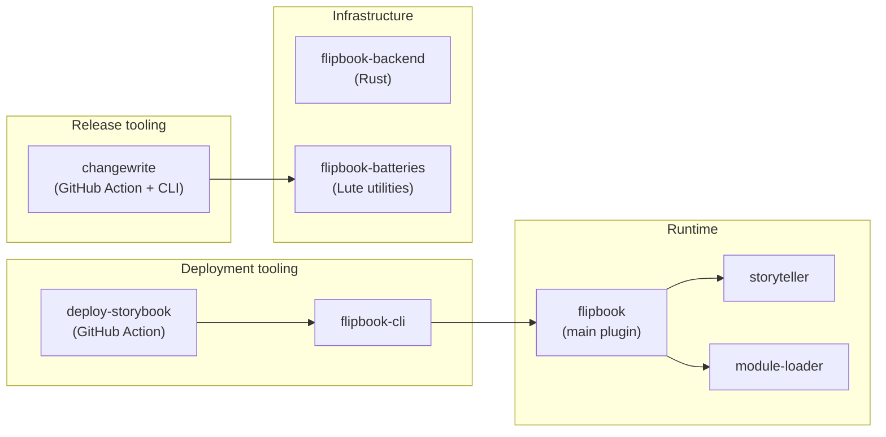

# Ecosystem

All active repos under [flipbook-labs](https://github.com/flipbook-labs), grouped by function.

## Runtime

**[flipbook](https://github.com/flipbook-labs/flipbook)** — The main Roblox Studio plugin. Discovers storybook files, loads stories in a sandboxed environment, and renders them in the plugin UI. Distributed on the [Creator Store](https://create.roblox.com/store/asset/8517129161).

**[storyteller](https://github.com/flipbook-labs/storyteller)** — Story discovery and rendering library. Handles the runtime side of loading stories: finding storybook modules, instantiating story functions, and cleaning up. Embedded in the flipbook plugin.

**[module-loader](https://github.com/flipbook-labs/module-loader)** — A ModuleScript loader that bypasses the `require` cache. Enables the sandbox isolation that lets stories be hot-reloaded without restarting the plugin. Embedded in the flipbook plugin.

## Deployment tooling

**[flipbook-cli](https://github.com/flipbook-labs/flipbook-cli)** — CLI for deploying a storybook `.rbxl` to a Roblox experience via Open Cloud. Resolves or creates the target place by name, publishes the place file, and injects the Flipbook runtime. Available via Rokit.

**[deploy-storybook](https://github.com/flipbook-labs/deploy-storybook)** — GitHub Action that wraps `flipbook-cli`. Handles Rokit install, builds the CLI from source, and runs the deploy. Supports per-PR preview places with automatic PR comments.

## Release tooling

**[changewrite](https://github.com/flipbook-labs/changewrite)** — GitHub Action and Lute CLI for managing release cycles. Contributors add changelog entries to `.changes/`; changewrite determines the next version, bundles the entries into `CHANGELOG.md`, and opens a draft publish PR that tags and releases on merge. Used across multiple flipbook-labs repos.

## Infrastructure

**[flipbook-backend](https://github.com/flipbook-labs/flipbook-backend)** — Rust backend service. Handles server-side concerns for the plugin (e.g. telemetry, update checks). Deployed on a DigitalOcean droplet via Docker Compose.

**[flipbook-batteries](https://github.com/flipbook-labs/flipbook-batteries)** — Shared Lute utility modules. Used as a dependency by changewrite and other tooling repos in the org.

> [!seealso]
> [[engineering/changewrite|Changewrite]] — Detailed changewrite docs
> [[usage/deploying-storybooks|Deploying Storybooks]] — User-facing deploy workflow
> [[engineering/backend-stack|Backend Stack]] — Backend infrastructure details
